# UNIVERSITATEA "LUCIAN BLAGA" DIN SIBIU
## Facultatea de Inginerie
### Specializarea: Calculatoare și Tehnologia Informației

---

<br><br><br>

# LUCRARE DE LICENȚĂ

---

<br><br>

# PIXEL CANVASCHAIN
## Platformă Colaborativă de Artă Pixelată pe Blockchain MultiversX cu Mecanisme NFT și Sistem de Donații

<br><br><br>

---

**Student:** [NUMELE STUDENTULUI]

**Coordonator Științific:** [TITLU ACADEMIC] [NUMELE COORDONATORULUI]

---

<br><br>

**Sibiu, 2026**

---

<div style="page-break-after: always;"></div>

---

# CUPRINS

- [Introducere](#introducere)
- [Capitolul 1: Fundamente Teoretice](#capitolul-1-fundamente-teoretice)
  - [1.1 Tehnologii Blockchain — Fundamente](#11-tehnologii-blockchain--fundamente)
  - [1.2 MultiversX — Ecosistemul Blockchain](#12-multiversx--ecosistemul-blockchain)
  - [1.3 Tokenomics și Modelul Economic al Proiectului](#13-tokenomics-și-modelul-economic-al-proiectului)
  - [1.4 NFT-uri și Semi-Fungible Tokens pe MultiversX](#14-nft-uri-și-semi-fungible-tokens-pe-multiversx)
  - [1.5 Arhitectura Hibridă Web2/Web3](#15-arhitectura-hibridă-web2web3)
  - [1.6 WebSockets și Comunicare în Timp Real](#16-websockets-și-comunicare-în-timp-real)
  - [1.7 React și Arhitectura Frontend Modernă](#17-react-și-arhitectura-frontend-modernă)
  - [1.8 Persistența Datelor — SQLite](#18-persistența-datelor--sqlite)
  - [1.9 Proiecte Similare și Poziționare](#19-proiecte-similare-și-poziționare)
- [Capitolul 2: Implementare](#capitolul-2-implementare)
  - [2.1 Arhitectura Generală a Sistemului](#21-arhitectura-generală-a-sistemului)
  - [2.2 Smart Contract — Rust pe MultiversX](#22-smart-contract--rust-pe-multiversx)
  - [2.3 Backend — Node.js cu Express și Socket.io](#23-backend--nodejs-cu-express-și-socketio)
  - [2.4 Frontend — React 18 cu Vite](#24-frontend--react-18-cu-vite)
  - [2.5 Fluxuri de Date Principale](#25-fluxuri-de-date-principale)
  - [2.6 Securitate și Validare](#26-securitate-și-validare)
- [Capitolul 3: Rezultate și Testare](#capitolul-3-rezultate-și-testare)
  - [3.1 Funcționalități Implementate](#31-funcționalități-implementate)
  - [3.2 Testare pe MultiversX Devnet](#32-testare-pe-multiversx-devnet)
  - [3.3 Performanță și Caracteristici Tehnice](#33-performanță-și-caracteristici-tehnice)
  - [3.4 Limitări Identificate](#34-limitări-identificate)
- [Concluzii](#concluzii)
- [Bibliografie](#bibliografie)

---

<div style="page-break-after: always;"></div>

---

# INTRODUCERE

## Contextul și Motivația Lucrării

În ultimii ani, tehnologiile blockchain au evoluat de la simple sisteme de transfer de valoare la platforme complexe capabile să găzduiască logică de afaceri, contracte auto-executabile și active digitale unice. Simultan, arta digitală colaborativă a câștigat un loc important în cultura online, culminând cu experimente sociale precum *r/place* — un experiment al platformei Reddit în care milioane de utilizatori au colaborat (și s-au confruntat) pentru a desena imagini pe un canvas partajat, folosind un simplu sistem bazat pe timp.

Această lucrare documentează proiectarea și implementarea **Pixel CanvasChain**, o platformă care combină conceptele de artă colaborativă în timp real cu puterea blockchain-ului MultiversX. Motivația centrală este de a rezolva o problemă fundamentală a artei digitale online: **lipsa proprietății verificabile și a transparenței**. Cine a desenat ce? Cine deține un pixel? Cum putem garanta că regulile jocului sunt respectate fără a ne baza pe o autoritate centrală?

Răspunsul propus este un sistem hibrid care îmbină viteza și experiența de utilizare a aplicațiilor Web2 tradiționale cu imutabilitatea și transparența unui blockchain public. Utilizatorii pictează pe un canvas partajat în timp real, iar fiecare acțiune este ancorată în blockchain prin tranzacții cu token-ul nativ al platformei, `$PIXEL`.

## Scopul și Contribuțiile Proiectului

Obiectivele principale ale lucrării sunt:

1. **Proiectarea și implementarea** unui sistem hibrid Web2/Web3 capabil să suporte interacțiune în timp real la nivel de sub-secundă, combinată cu settlement on-chain verificabil.
2. **Crearea unui ecosistem economic** sustenabil bazat pe token-ul ESDT `$PIXEL`, cu un mecanism de distribuire a veniturilor care susține donații caritabile (50% din venituri), deflaționare prin ardere (25%) și acoperire a costurilor operaționale (25%).
3. **Implementarea unui smart contract complex** în limbajul Rust, folosind framework-ul MultiversX, care gestionează epoci de joc, licitații pentru zone speciale ale canvas-ului, votul democratic pentru charitate și mintarea de NFT-uri ca recompense.
4. **Demonstrarea fezabilității** unui model de aplicație descentralizată (dApp) care nu sacrifică experiența de utilizare pentru a obține garanțiile criptografice ale blockchain-ului.

Contribuția originală față de proiectele existente constă în combinarea inedită a mai multor mecanisme: sistemul de epoci cu reset periodic, licitațiile pentru zone premium de canvas, votul on-chain pentru direcționarea donațiilor caritabile și generarea automată de NFT-uri ca dovezi de participare la finalul fiecărei epoci.

## Structura Lucrării

**Capitolul 1** prezintă fundamentele teoretice necesare înțelegerii proiectului: conceptele blockchain, ecosistemul MultiversX, tokenomics, NFT-uri, arhitectura hibridă Web2/Web3, WebSockets, React și SQLite.

**Capitolul 2** descrie în detaliu implementarea fiecărui strat al sistemului: smart contract-ul Rust, backend-ul Node.js și frontend-ul React, însoțite de diagrame arhitecturale, de clase și de secvență.

**Capitolul 3** prezintă rezultatele obținute, testarea pe devnet-ul MultiversX, caracteristicile de performanță și limitările identificate.

**Concluziile** sintetizează realizările proiectului și propun direcții de dezvoltare ulterioară.

---

<div style="page-break-after: always;"></div>

---

# CAPITOLUL 1: FUNDAMENTE TEORETICE

## 1.1 Tehnologii Blockchain — Fundamente

### 1.1.1 Concepte de Bază

Un **blockchain** este o structură de date distribuită și imuabilă, compusă dintr-o serie de blocuri legate criptografic. Fiecare bloc conține un set de tranzacții, un marcaj temporal, o referință criptografică (hash) la blocul anterior și un nonce utilizat în procesul de consens. Caracteristicile fundamentale ale unui blockchain sunt:

- **Descentralizarea**: Nu există o autoritate centrală care controlează rețeaua. Validarea tranzacțiilor este realizată de un set distribuit de noduri participante.
- **Imutabilitatea**: Odată incluse într-un bloc confirmat, datele nu pot fi modificate fără a invalida toate blocurile ulterioare — ceea ce ar necesita un efort computațional impracticabil.
- **Transparența**: Pe un blockchain public, toate tranzacțiile sunt vizibile oricui, putând fi auditate independent.
- **Execuția trustless**: Regulile de business sunt codificate în smart contracts, programe care se execută automat pe fiecare nod din rețea, fără posibilitatea de intervenție sau cenzură unilaterală.

### 1.1.2 Smart Contracts

Un **smart contract** este un program stocat pe blockchain care se execută automat atunci când condițiile pre-definite sunt îndeplinite. Conceptul a fost popularizat de platforma Ethereum și este acum disponibil pe majoritatea blockchain-urilor moderne, inclusiv MultiversX.

Smart contract-urile elimină necesitatea unui intermediar de încredere: codul este public, executat identic pe toate nodurile rețelei și produce rezultate deterministe. Odată deploiat, un smart contract nu poate fi modificat (cu excepția mecanismelor de upgrade explicit prevăzute).

### 1.1.3 Tipuri de Token-uri

Pe blockchain-urile moderne există mai multe tipuri de active digitale:

- **Fungible Tokens (FT)**: Token-uri interschimbabile, unde fiecare unitate este identică cu orice altă unitate (similar cu moneda fiat). Exemple: EGLD, PIXEL.
- **Non-Fungible Tokens (NFT)**: Token-uri unice, fiecare cu un identificator distinct. Utilizate pentru a reprezenta drepturi de proprietate asupra activelor digitale (artă, colecționabile).
- **Semi-Fungible Tokens (SFT)**: Un hibrid — există mai multe copii ale aceluiași token (un tiraj limitat), dar cantitatea este finită și controlată.

---

## 1.2 MultiversX — Ecosistemul Blockchain

### 1.2.1 Prezentare Generală

**MultiversX** (fostul Elrond) este un blockchain public de generație nouă, proiectat pentru scalabilitate de înaltă performanță. Principala sa inovație arhitecturală este **Adaptive State Sharding** — o tehnologie care partajează atât starea rețelei, cât și procesarea tranzacțiilor în shard-uri paralele, permițând o capacitate teoretică de 15.000+ tranzacții pe secundă cu latență de ~6 secunde per bloc.

Moneda nativă a rețelei este **EGLD** (eGold), utilizată pentru plata taxelor de tranzacție (gas) și ca mijloc de schimb în ecosistem.

### 1.2.2 ESDT — eStandard Digital Token

**ESDT** (eStandard Digital Token) este standardul nativ de token al MultiversX. Spre deosebire de Ethereum (unde token-urile ERC-20 sunt smart contracts separate), token-urile ESDT sunt gestionate direct de protocolul MultiversX. Aceasta aduce avantaje semnificative:

- **Performanță nativă**: Transferurile ESDT sunt procesate la același nivel ca transferurile EGLD, fără overhead suplimentar de contract.
- **Securitate**: Logica de transfer este auditată și verificată la nivelul protocolului.
- **Interoperabilitate**: Orice smart contract poate accepta, trimite sau arde token-uri ESDT folosind API-ul standard.

Token-ul `$PIXEL` utilizat în acest proiect este un token ESDT fungibil, creat și administrat prin smart contract.

### 1.2.3 Smart Contracts în Rust

MultiversX oferă un framework dedicat pentru scrierea smart contracts în **Rust**, numit `multiversx-sc`. Rust a fost ales datorită:

- **Siguranței memoriei**: Rust elimină la nivel de compilator clase întregi de bug-uri (null pointer dereferences, buffer overflows, race conditions) fără un garbage collector.
- **Performanței**: Codul Rust compilat este extrem de eficient, reducând costurile de gas.
- **Expresivității**: Framework-ul `multiversx-sc` oferă macro-uri și tipuri specializate (ex. `BigUint`, `ManagedVec`, `ManagedBuffer`) care simplifică interacțiunea cu protocolul.

Contractele sunt compilate în WebAssembly (WASM) înainte de deployment pe blockchain.

### 1.2.4 Rețele de Test (Devnet / Testnet)

MultiversX oferă mai multe medii de testare:

- **Devnet**: Mediu de dezvoltare cu funcționalitate completă, unde token-urile nu au valoare reală. Utilizat în acest proiect.
- **Testnet**: Mediu de testare mai stabil, pentru validare înainte de lansare pe mainnet.
- **Mainnet**: Rețeaua principală cu valoare economică reală.

---

## 1.3 Tokenomics și Modelul Economic al Proiectului

### 1.3.1 Definiția Tokenomics

**Tokenomics** (token + economics) se referă la designul și analiza sistemelor economice bazate pe token-uri digitale. Un model tokenomic bine proiectat trebuie să răspundă la întrebări precum: Cum sunt create și distribuite token-urile? Care este mecanismul cerere-ofertă? Cum este prevenită inflația excesivă?

### 1.3.2 Sistemul de Tier-uri $PIXEL

Token-ul `$PIXEL` se achiziționează prin schimbul de EGLD în smart contract. Sistemul implementează un model de **tier-uri** cu bonus progresiv pentru a încuraja achizițiile mai mari:

| Tier | Cost (EGLD) | Pixeli de Bază | Bonus Pixeli | Total Pixeli | Bonus % |
|------|-------------|----------------|--------------|--------------|---------|
| Novice | 0.05 | 1,000 | 0 | 1,000 | 0% |
| Apprentice | 0.25 | 5,000 | 500 | 5,500 | 10% |
| Artisan | 0.50 | 10,000 | 2,000 | 12,000 | 20% |
| Master | 1.25 | 50,000 | 15,000 | 65,000 | 30% |
| Legend | 2.50 | 100,000 | 50,000 | 150,000 | 50% |

### 1.3.3 Distribuirea Veniturilor (25/25/50)

Un aspect central al modelului economic este mecanismul de distribuire a veniturilor generat la fiecare achiziție de pixeli, implementat direct în smart contract:

```
Fiecare plată EGLD → buyPixels()
    ├── 50% → adresa carității câștigătoare (votul comunității)
    ├── 25% → adresa "null" (burn — deflaționare)
    └── 25% → trezoreria proiectului (costuri operaționale)
```

Diagrama de mai jos ilustrează fluxul de token-uri:

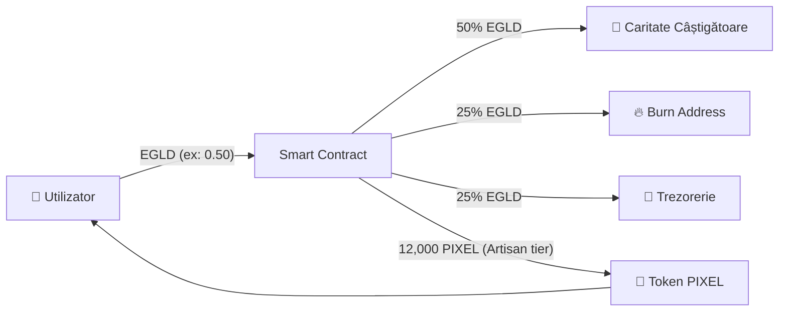

### 1.3.4 Mecanismul de Ardere (Burn)

Arderea (burn) a 25% din veniturile EGLD contribuie la reducerea treptată a ofertei circulante de EGLD utilizat în ecosistem, creând o presiune deflacionară pe termen lung. Aceasta este o practică comună în proiectele DeFi pentru a menține valoarea token-urilor.

---

## 1.4 NFT-uri și Semi-Fungible Tokens pe MultiversX

### 1.4.1 Standardul NFT pe MultiversX

Pe MultiversX, NFT-urile sunt implementate ca un tip special de ESDT cu:
- **Nonce unic**: Fiecare NFT are un nonce care îl diferențiază de altele din aceeași colecție.
- **Atribute on-chain**: Metadate stocate direct pe blockchain (ex: `"epoch:3;type:painter;pixels:1250"`).
- **URI**: Link către resursa media asociată (imagine stocată pe IPFS sau CDN).
- **Royalties**: Procentaj de redevențe plătite creatorului la fiecare revânzare.

### 1.4.2 Cazuri de Utilizare în Pixel CanvasChain

Proiectul mintează două tipuri de NFT-uri la finalul fiecărei epoci:

1. **"Painter of Epoch X" NFT**: Acordat utilizatorului care a plasat cel mai mare număr de pixeli în acea epocă. NFT-ul conține imaginea întregului canvas (100×100 pixeli) la momentul încheierii epocii.

2. **"Auction Winner Epoch X" NFT**: Acordat câștigătorului licitației pentru zona premium (20×20 pixeli). NFT-ul conține imaginea zonei licitată, reprezentând un activ digital unic care certifică achiziția zonei respective.

---

## 1.5 Arhitectura Hibridă Web2/Web3

### 1.5.1 Problema Scalabilității On-Chain

Plasarea fiecărui pixel direct pe blockchain ar implica:
- **Latență**: ~6 secunde per tranzacție pe MultiversX devnet.
- **Cost**: Fiecare tranzacție consumă gas (taxe de rețea).
- **Experiență degradată**: Un canvas colaborativ în timp real necesită actualizări sub-secundă.

Dacă 100 de utilizatori simultani ar plasa pixeli, fiecare la 1 pixel/secundă, sistemul ar genera 6.000 de tranzacții pe minut — impracticabil pentru un blockchain public.

### 1.5.2 Modelul Optimistic UI cu Settlement On-Chain

Soluția adoptată este un **model hibrid** în două straturi:

**Stratul rapid (off-chain)**:
- Utilizatorul pictează un pixel → clientul emite imediat evenimentul Socket.io.
- Server-ul actualizează starea în memorie și propagă schimbarea tuturor clienților conectați.
- Latența efectivă: <100ms.

**Stratul de settlement (on-chain)**:
- Clientul semnează o tranzacție `paintPixels()` cu wallet-ul xPortal.
- Tranzacția este trimisă către devnet.
- Server-ul monitorizează confirmarea tranzacției prin polling pe API-ul devnet.
- La confirmare: pixelii sunt persistați în SQLite (starea "confirmată").
- La eșec: pixelii sunt reveniți (optimistic rollback).

Această arhitectură este similară cu modelul **optimistic updates** folosit în aplicații Web2 moderne (ex: interfețele social media care afișează like-ul imediat, înaintea confirmării serverului).

### 1.5.3 Comparație cu Alternativele

| Abordare | Latență | Cost | Decentralizare | Utilizabilitate |
|----------|---------|------|----------------|-----------------|
| Complet on-chain | ~6s | Ridicat | Maximă | Slabă |
| Complet off-chain | <100ms | Minim | Zero | Excelentă |
| **Hibrid (ales)** | **<100ms** | **Moderat** | **Parțială** | **Excelentă** |

---

## 1.6 WebSockets și Comunicare în Timp Real

### 1.6.1 Limitările HTTP Clasic

Protocolul HTTP tradițional este **request-response**: clientul inițiază o cerere, serverul răspunde, conexiunea se închide. Pentru un canvas colaborativ unde sute de utilizatori plasează pixeli simultan, această abordare este inadecvată:

- **HTTP Polling**: Clientul interogă serverul la fiecare N secunde. Consumă resurse inutil și introduce latență artificială.
- **Long Polling**: Serverul menține conexiunea deschisă până când există date noi. Mai eficient, dar complex de implementat la scară.

### 1.6.2 WebSockets — Conexiune Bidirecțională Persistentă

**WebSocket** este un protocol de comunicare care stabilește o conexiune bidirecțională persistentă între client și server. Odată stabilită, ambele părți pot trimite date oricând, fără overhead de re-conectare.

Avantajele pentru Pixel CanvasChain:
- **Propagare instantanee**: Când utilizatorul A pictează un pixel, toți ceilalți utilizatori conectați primesc actualizarea în <10ms (latența rețelei).
- **Eficiență**: O singură conexiune persistentă înlocuiește sute de cereri HTTP pe minut.
- **Evenimente rich**: Socket.io (biblioteca utilizată) extinde WebSocket cu funcționalități de tip **rooms**, **namespaces** și **reconnection automată**.

### 1.6.3 Socket.io — Arhitectura Event-Driven

**Socket.io** este o bibliotecă JavaScript care abstractizează WebSocket și oferă un API bazat pe evenimente. Funcționează pe principiul **emit/on**:

```
Client emite "pixel:paint" → Server recepționează → Server emite "pixel:update" → Toți clienții primesc
```

Socket.io gestionează automat:
- Degradare gracioasă la long-polling dacă WebSocket nu e disponibil
- Reconnectare automată la pierderea conexiunii
- Heartbeat periodic pentru detectarea deconexiunilor

---

## 1.7 React și Arhitectura Frontend Modernă

### 1.7.1 React 18 — Biblioteca UI

**React** este o bibliotecă JavaScript pentru construirea interfețelor utilizator bazată pe conceptul de **component tree**. Interfața este împărțită în componente reutilizabile, fiecare cu propriul state și lifecycle.

React 18 introduce **Concurrent Rendering** — capacitatea de a întrerupe și relua randarea componentelor, permițând aplicațiilor să rămână responsive chiar și în timpul operațiunilor computaționale intensive (ex: actualizarea a sute de pixeli simultan pe canvas).

### 1.7.2 Context API — Gestionarea Stării Globale

**Context API** este mecanismul nativ React pentru partajarea stării între componente fără a pasa props prin fiecare nivel al ierarhiei (prop drilling). În Pixel CanvasChain, `AppContext` expune:

- Starea wallet-ului (adresă, sold EGLD, sold PIXEL)
- Starea grid-ului (matricea de culori 100×100)
- Informații despre epoca curentă
- Starea licitației active
- Starea votului pentru caritate

### 1.7.3 Custom Hooks — Separarea Responsabilităților

**Custom hooks** sunt funcții React care încapsulează logică cu stare și efecte secundare, putând fi reutilizate în mai multe componente. Proiectul utilizează extensiv acest pattern:

- `useSocket` — gestionează conexiunea Socket.io și evenimentele asociate
- `useCanvas` — gestionează randarea canvas-ului, zoom/pan, interacțiunile mouse
- `useWallet` — abstractizează integrarea MultiversX SDK-dapp
- `usePixelBalance` — interogează periodic soldul de token PIXEL de pe blockchain

### 1.7.4 HTML5 Canvas API

Elementul `<canvas>` HTML5 permite desenarea 2D prin JavaScript, folosind un context grafic. Este folosit în proiect pentru randarea eficientă a celor 10,000 de pixeli (100×100), cu suport pentru:
- Zoom (0.5x–32x) și pan
- Randare parțială (culling) pentru performanță
- Efecte vizuale (flash la actualizare, evidențiere zonă licitație)

---

## 1.8 Persistența Datelor — SQLite

### 1.8.1 Alegerea SQLite

**SQLite** este o bază de date relațională serverless, stocată într-un singur fișier. A fost aleasă pentru backend-ul proiectului din mai multe motive:

- **Simplitate operațională**: Nu necesită un server separat de baze de date.
- **Performanță**: Pentru un canvas de 10,000 pixeli, SQLite oferă performanță excelentă.
- **Portabilitate**: Fișierul `canvas.db` poate fi copiat/arhivat trivial.

### 1.8.2 WAL Mode — Acces Concurent

SQLite în modul implicit (journal mode) nu permite citiri concurente cu scrierile. Proiectul activează **WAL (Write-Ahead Logging) mode**, care permite citirile să se desfășoare concurent cu scrierile, esențial pentru un server cu multiple conexiuni WebSocket simultane.

### 1.8.3 Strategia Dual-Grid

Un aspect arhitectural important al backend-ului este menținerea a **două reprezentări** ale canvas-ului:

- **`grid[][]`** — starea "vie", optimistă, în memorie: reflectă toate pixelii plasați, inclusiv cei așteptând confirmarea blockchain.
- **`confirmedGrid[][]`** — starea "confirmată", bazată exclusiv pe pixelii persistați în SQLite (tranzacții blockchain confirmate).

Când un utilizator nou se conectează, primește `confirmedGrid` — imaginea certă, fără pixeli speculativi. Aceasta previne inconsistențe în cazul în care tranzacțiile pending eșuează.

---

## 1.9 Proiecte Similare și Poziționare

### 1.9.1 r/place (Reddit, 2017, 2022)

**r/place** a fost un experiment social al Reddit în care utilizatorii puteau plasa câte un pixel de culoare pe o grilă partajată, cu un cooldown de câteva minute între plasări. Experimentul a demonstrat puterea colaborării și competiției la scară masivă (milioane de utilizatori).

Limitele r/place din perspectiva Web3:
- Controlat de o entitate centralizată (Reddit).
- Nu există proprietate verificabilă sau recompense economice.
- Canvas-ul este permanent șters după experiment.

### 1.9.2 Proiecte Blockchain Pixel Art Existente

Au existat diverse proiecte de pixel art pe blockchain (MillionDollarHomepage inspirate, Ethereum-based grids), dar marea majoritate suferă de aceeași problemă: plasarea fiecărui pixel ca tranzacție individuală face interacțiunea lentă și costisitoare.

### 1.9.3 Diferențiatorii Pixel CanvasChain

Pixel CanvasChain se diferențiază prin:

1. **Arhitectura hibridă**: Experiență Web2 instantanee cu ancorare Web3.
2. **Sistemul de epoci**: Canvas reset periodic creează urgență și reînnoire.
3. **Licitații pentru zone premium**: Mecanism economic inovativ pentru spații vizibile.
4. **Votul democratic pentru donații**: Comunitatea decide direcția fondurilor caritabile.
5. **NFT-uri ca dovezi de participare**: Recompense tangibile pentru contribuitorii activi.
6. **Misiunea socială**: 50% din venituri donate automat prin smart contract.

---

<div style="page-break-after: always;"></div>

---

# CAPITOLUL 2: IMPLEMENTARE

## 2.1 Arhitectura Generală a Sistemului

### 2.1.1 Cele Trei Straturi ale Sistemului

Pixel CanvasChain este structurat în trei straturi distincte, fiecare cu responsabilități clare:

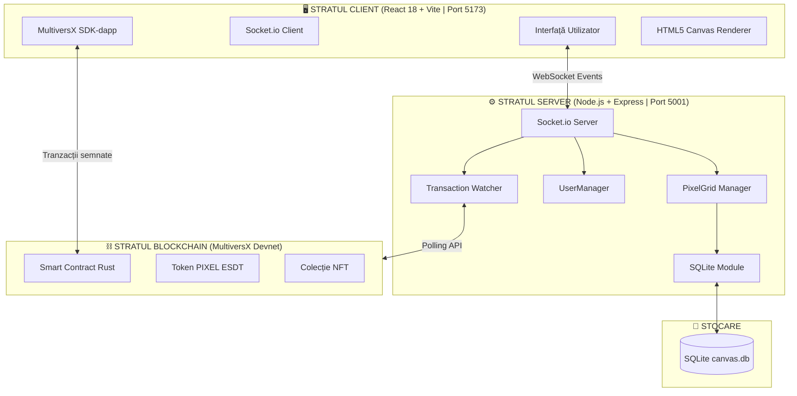

### 2.1.2 Fluxul Principal de Date — Pictura unui Pixel

Fluxul complet al unei acțiuni de pictat un pixel, de la click-ul utilizatorului până la persistența on-chain:

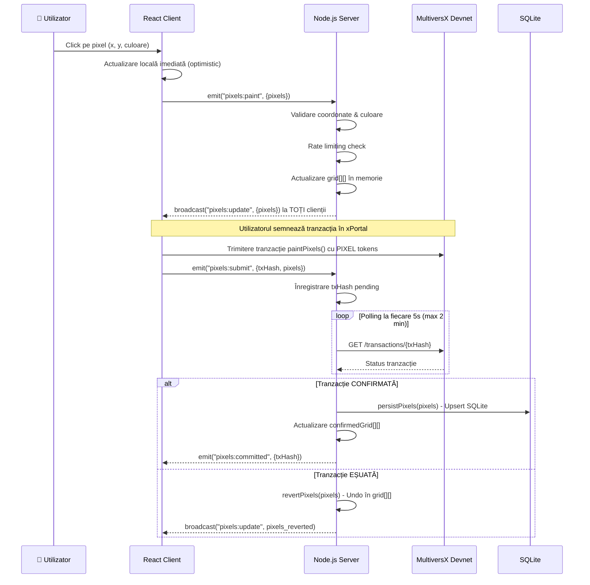

---

## 2.2 Smart Contract — Rust pe MultiversX

### 2.2.1 Structuri de Date

Smart contract-ul este implementat în fișierul `pixel-canvas-contract/src/pixel_canvas_contract.rs` (830+ linii). Structura principală de date pentru reprezentarea unui pixel este:

```
PixelData {
    x: u32       — coordonata orizontală (0-99)
    y: u32       — coordonata verticală (0-99)
    color: u32   — culoarea ca valoare RGB packed
}
```

Starea contractului este stocată în **storage mappings** — structuri de date persistente pe blockchain, echivalente cu tabele de baze de date:

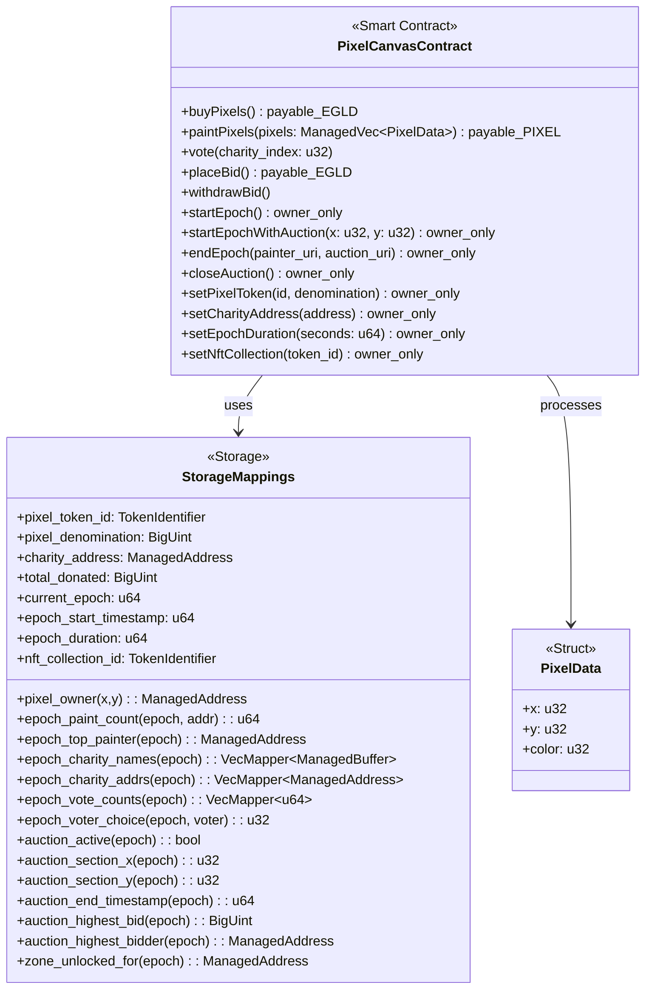

### 2.2.2 Sistemul de Epoci (Epoch Management)

O **epocă** reprezintă o perioadă de timp limitată în care utilizatorii pot picta pe canvas. La sfârșitul epocii, canvas-ul este "înghețat", NFT-urile sunt mintate și o nouă epocă poate începe.

Starea unei epoci este controlată prin storage mappings, iar tranzițiile sunt gestionate de funcțiile owner-only:

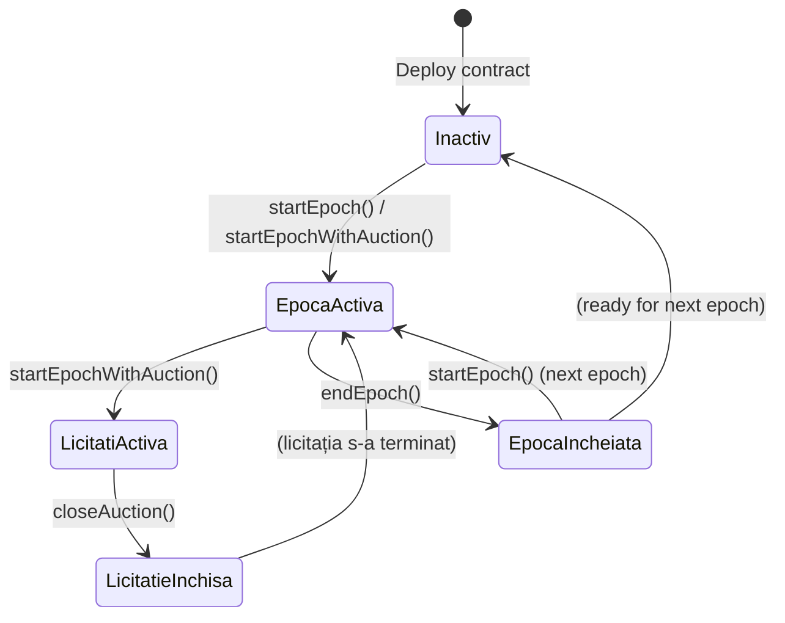

### 2.2.3 Mecanismul de Cumpărare PIXEL și Distribuirea Veniturilor

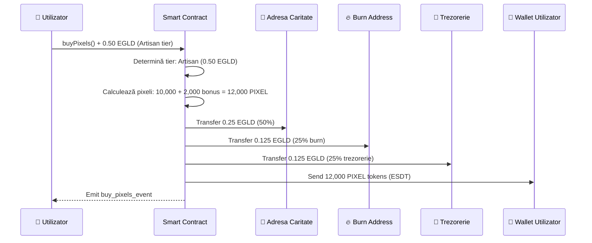

### 2.2.4 Pictura Pixelilor cu Sistem de Proprietate

O inovație importantă este că fiecare pixel are un **proprietar on-chain**. Pictarea unui pixel deja deținut costă 2 PIXEL (în loc de 1), din care 1 PIXEL se duce ca royalty proprietarului anterior.

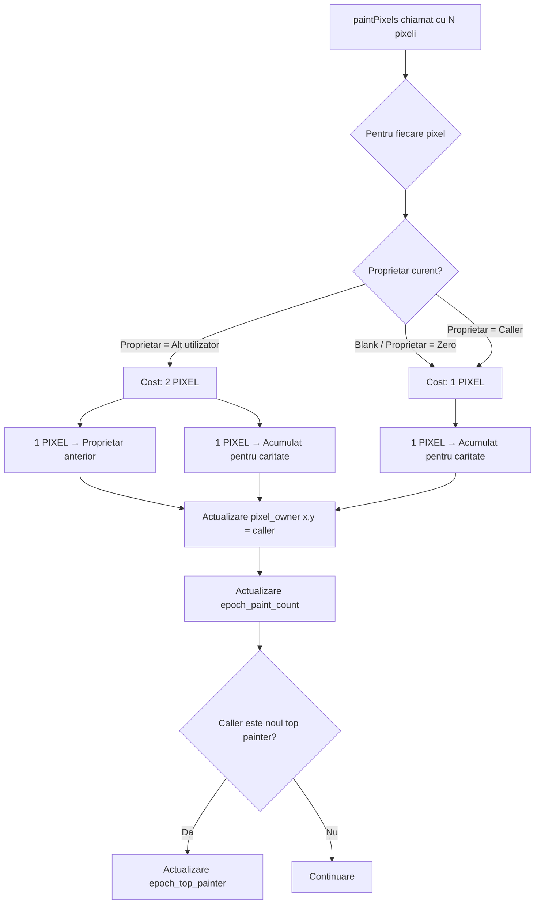

### 2.2.5 Sistemul de Licitații (Auction)

La inițierea unei epoci cu licitație, o zonă de 20×20 pixeli din canvas devine un "spațiu premium" licitabil. Oricine poate plasa o ofertă în EGLD, câștigătorul primind:
- Dreptul exclusiv de a picta în zona respectivă pe durata epocii.
- Un NFT reprezentând zona câștigată.

### 2.2.6 Mintarea NFT-urilor la Finalul Epocii

```mermaid
sequenceDiagram
    participant O as 👑 Owner
    participant SC as Smart Contract
    participant TP as 🎨 Top Painter
    participant AW as 🏆 Auction Winner

    O->>SC: endEpoch(painter_uri, auction_uri)
    SC->>SC: Verifică epoch_ended == false
    SC->>SC: Distribuie PIXEL acumulat → caritate câștigătoare
    SC->>SC: Distribuie EGLD votat → caritate câștigătoare

    SC->>SC: Mint NFT "Painter of Epoch X"
    Note over SC: Atribute: epoch:X;type:painter;pixels:N
    SC->>TP: Transfer NFT către top painter

    alt Există câștigător licitație
        SC->>SC: Mint NFT "Auction Winner Epoch X"
        Note over SC: Atribute: epoch:X;type:auction;section:X,Y
        SC->>AW: Transfer NFT către câștigător licitație
    end

    SC->>SC: Setează epoch_ended = true
    SC-->>O: Epoch closed
```

---

## 2.3 Backend — Node.js cu Express și Socket.io

### 2.3.1 Diagrama de Clase Backend

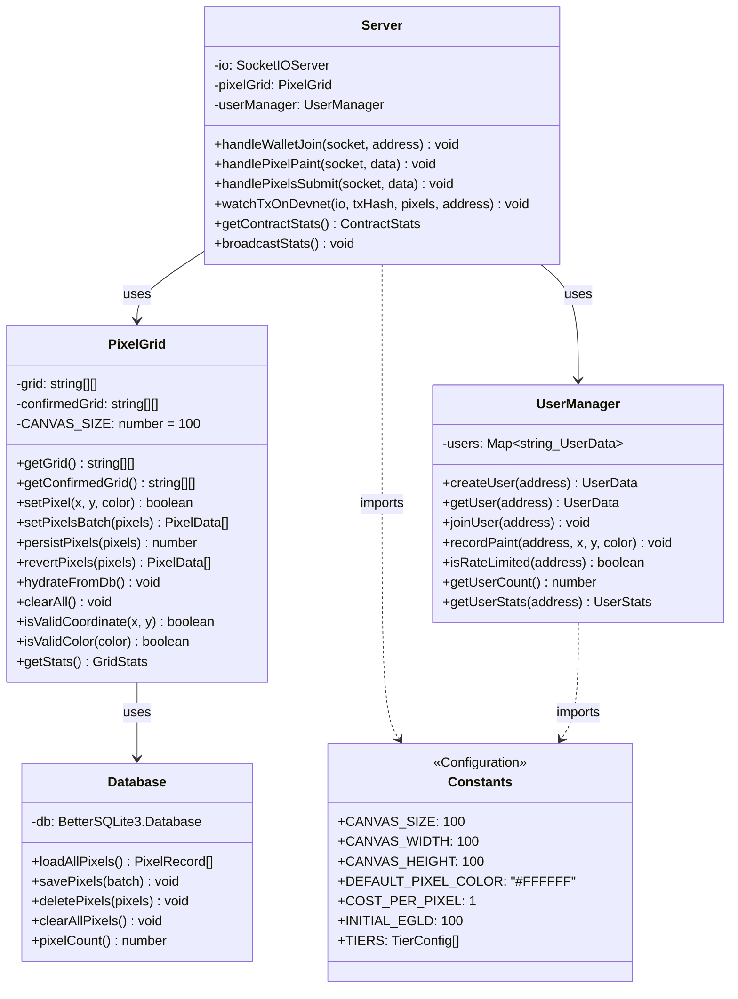

### 2.3.2 Schema Bazei de Date SQLite

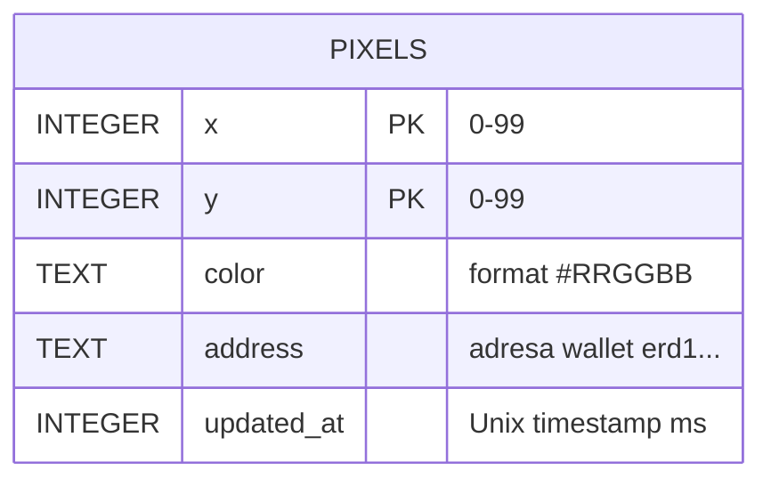

**Note implementare**:
- Cheia primară compusă `(x, y)` asigură unicitatea fiecărui pixel.
- Semantică upsert: la plasarea unui pixel existent, rândul este actualizat (nu duplicat).
- Pixelii albi (default) nu sunt stocați explicit — absența unui rând înseamnă culoarea `#FFFFFF`.
- Modul WAL activat pentru concurență optimă.

### 2.3.3 Modulul PixelGrid — Strategia Dual-Grid

Cel mai important modul al backend-ului este `pixelGrid.js`, care gestionează starea canvas-ului prin două structuri paralele:

```mermaid
flowchart LR
    subgraph MEMORY["Memorie RAM"]
        G["grid[ ][ ]\n(stare live/optimistă)"]
        CG["confirmedGrid[ ][ ]\n(stare confirmată on-chain)"]
    end

    subgraph DB["SQLite"]
        PIXELS_TABLE["pixels table\n(sursa de adevăr)"]
    end

    subgraph EVENTS["Evenimente"]
        PAINT["pixel:paint\n(instant)"]
        CONFIRM["tx confirmată"]
        FAIL["tx eșuată"]
        BOOT["server restart"]
    end

    PAINT -->|setPixel()| G
    CONFIRM -->|persistPixels()| PIXELS_TABLE
    CONFIRM -->|actualizare| CG
    FAIL -->|revertPixels()| G
    BOOT -->|hydrateFromDb()| CG
    BOOT -->|copie| G
```

### 2.3.4 Transaction Watcher — Reziliență la Deconectare

Un aspect critic al sistemului este că procesul de confirmare a tranzacțiilor rulează **server-side**, nu client-side. Aceasta înseamnă că dacă utilizatorul închide tab-ul după ce a semnat tranzacția, server-ul continuă să monitorizeze confirmarea și va persista pixelii când tranzacția se confirmă.

**Algoritmul Transaction Watcher:**
1. La primirea `pixels:submit` de la client, server-ul înregistrează `{txHash, pixels, address}`.
2. Server-ul pornește un polling pe API-ul devnet la fiecare 5 secunde.
3. Timeout după 24 de iterații (2 minute).
4. La succes: `persistPixels()` + `emit("pixels:committed")`.
5. La eșec/timeout: `revertPixels()` + broadcast rollback.

---

## 2.4 Frontend — React 18 cu Vite

### 2.4.1 Diagrama de Componente React

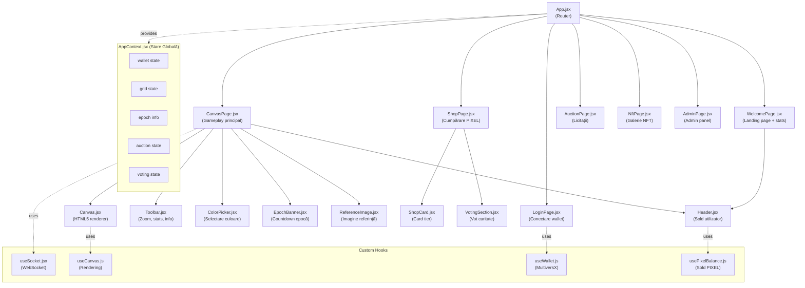

### 2.4.2 AppContext — Gestionarea Stării Globale

`AppContext.jsx` este centrul de control al aplicației frontend. Folosind React Context API, expune starea globală tuturor componentelor din arbore, fără necesitatea trecerii props prin fiecare nivel.

Starea gestionată include:

| Secțiune | Date | Sursă |
|----------|------|-------|
| `wallet` | adresă, sold EGLD, sold PIXEL, isConnected | MultiversX SDK + devnet API |
| `gridState` | matricea de culori 100×100 | Socket.io (server) |
| `epochInfo` | epoch curent, durată, timestamp start | Contract view queries |
| `auctionState` | activ, coordonate, ofertă maximă, câștigător | Contract view queries |
| `votingState` | carități, voturi, vot propriu | Contract view queries |

### 2.4.3 useCanvas — Rendering și Interacțiune

Hook-ul `useCanvas.js` encapsulează toată logica complexă a canvas-ului HTML5:

**Rendering performant**: Algoritmul de randare calculează porțiunea vizibilă a canvas-ului în funcție de zoom și offset, randând exclusiv pixelii vizibili (view frustum culling adaptat 2D).

**Zoom și Pan**: 
- Scroll mouse: ajustare nivel de zoom (0.5x–32x)
- Click mijloc/dreapta + drag: pan pe canvas
- La zoom > 5x: afișare grilă suprapusă pentru navigare precisă

**Brush Sizes**: Utilizatorul poate selecta un brush de 1×1, 2×2, 3×3 sau 4×4 pixeli.

**Flash Effect**: La primirea unui pixel de la un alt utilizator (via Socket.io), pixelul respectiv animează scurt (flash) pentru a indica activitate recentă.

### 2.4.4 useSocket — Comunicare WebSocket

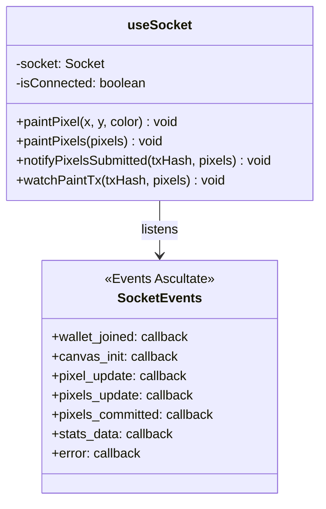

---

## 2.5 Fluxuri de Date Principale

### 2.5.1 Autentificarea cu Wallet xPortal

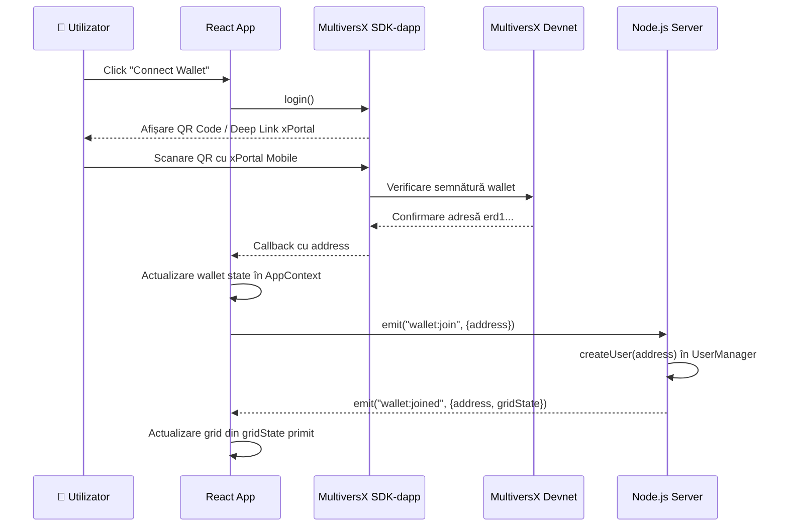

### 2.5.2 Pictura Unui Pixel — Flux Complet

A se vedea **Secțiunea 2.1.2** pentru diagrama detaliată a acestui flux.

### 2.5.3 Finalizarea Epocii — NFT Minting

A se vedea **Secțiunea 2.2.6** pentru diagrama detaliată.

### 2.5.4 Plasarea unei Licitații

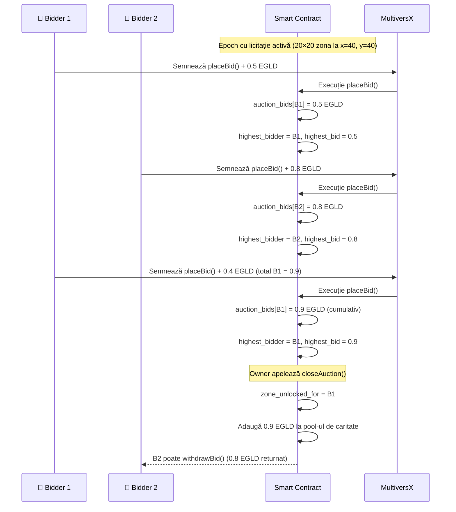

---

## 2.6 Securitate și Validare

### 2.6.1 Validare Server-Side

Server-ul Node.js implementează multiple niveluri de validare:

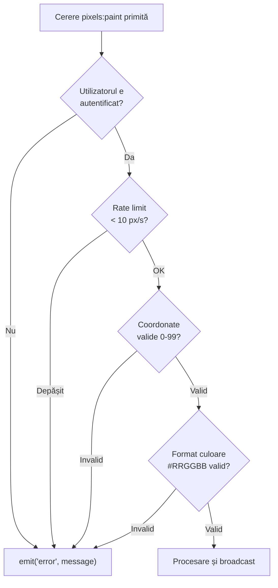

### 2.6.2 Securitatea Smart Contract-ului

Smart contract-ul implementează mai multe mecanisme de securitate:

- **Owner-only endpoints**: Funcțiile administrative (`startEpoch`, `endEpoch`, `closeAuction`, configurare) sunt accesibile exclusiv proprietarului contractului (adresa care l-a deploiat).
- **Verificări epoch**: `endEpoch` verifică că `epoch_ended == false` pentru a preveni double-minting de NFT-uri.
- **Validare licitație**: `placeBid` verifică că licitația este activă și că timestamp-ul curent nu a depășit `auction_end_timestamp`.
- **Retragere securizată**: `withdrawBid` permite recuperarea fondurilor doar pentru utilizatorii care nu sunt `highest_bidder` (sau după închiderea licitației).

### 2.6.3 Securitatea Arhitecturii Client-Server

**Server-authoritative state**: Clientul nu poate modifica direct starea canvas-ului. Orice actualizare trebuie să treacă prin server-ul Node.js, care validează și autorizează înainte de broadcast. Clientul primește actualizările prin Socket.io și nu poate manipula starea altor utilizatori.

**No trust client data**: Server-ul nu acceptă date direct de la client fără validare. Pixelii sunt validați independent de orice informație trimisă de client.

---

<div style="page-break-after: always;"></div>

---

# CAPITOLUL 3: REZULTATE ȘI TESTARE

## 3.1 Funcționalități Implementate

### 3.1.1 Tablou Comparativ: Planificat vs. Implementat

| Funcționalitate | Planificat | Implementat | Observații |
|----------------|-----------|-------------|------------|
| Canvas real-time 100×100 | ✅ | ✅ | WebSocket sub 100ms |
| Autentificare wallet MultiversX | ✅ | ✅ | xPortal, Browser Extension |
| Token $PIXEL ESDT | ✅ | ✅ | Devnet |
| Sistem de tier-uri (5 tier-uri) | ✅ | ✅ | Novice → Legend |
| Distribuire 25/25/50 | ✅ | ✅ | Smart contract enforced |
| Proprietate pixeli on-chain | ✅ | ✅ | pixel_owner[x][y] mapping |
| Sistem de epoci | ✅ | ✅ | Durata configurabilă |
| Vot democratic pentru caritate | ✅ | ✅ | 1 vot/wallet/epocă |
| Licitații pentru zone premium | ✅ | ✅ | Zone 20×20 pixeli |
| NFT pentru top painter | ✅ | ✅ | Mintat la endEpoch |
| NFT pentru câștigătorul licitației | ✅ | ✅ | Mintat la endEpoch |
| Admin dashboard | ✅ | ✅ | Control epoci, configurare |
| Persistență SQLite | ✅ | ✅ | Supraviețuiește restartului |
| Dual-grid strategy | ✅ | ✅ | Live vs. confirmed |
| Transaction watcher server-side | ✅ | ✅ | Polling devnet 5s |
| Brush sizes multiple | ✅ | ✅ | 1x1, 2x2, 3x3, 4x4 |
| Imagine de referință overlay | ✅ | ✅ | Transparență ajustabilă |
| Canvas 1000×1000 | ✅ | ❌ | Faza 4 (viitor) |
| IPFS snapshots periodice | ✅ | ❌ | Faza 4 (viitor) |
| Generare AI NFT-uri | ✅ | ❌ | Faza 4 (viitor) |
| Deployment mainnet | ✅ | ❌ | Faza 4 (viitor) |

### 3.1.2 Cele Trei Faze de Dezvoltare

**Faza 1 — MVP (Real-time Canvas):**
- Canvas 100×100 funcțional cu WebSockets
- Wallet mock (fără blockchain real)
- Persistență in-memory
- Brush și color picker

**Faza 2 — Integrare Blockchain:**
- Conectare wallet real (MultiversX SDK-dapp)
- Smart contract cu `buyPixels()` și `paintPixels()`
- Sistem de tier-uri și token PIXEL
- Distribuire venituri 25/25/50
- Persistență SQLite + transaction watcher
- Sistem de vot caritate

**Faza 3 — Funcționalități Avansate:**
- Mecanismul de licitații (20×20 zone)
- Mintare NFT la finalul epocii (top painter + auction winner)
- Admin dashboard complet
- Pagini NFT gallery și Auction

---

## 3.2 Testare pe MultiversX Devnet

### 3.2.1 Testarea Smart Contract-ului

Contractul a fost deploiat pe **MultiversX Devnet** și testat prin MultiversX Explorer și CLI. Principalele scenarii testate:

**Scenariu 1 — Cumpărare PIXEL tier Artisan:**
- Input: 0.50 EGLD
- Expected: Utilizatorul primește 12,000 PIXEL tokens
- Distribuire: 0.25 EGLD → caritate, 0.125 EGLD → burn, 0.125 EGLD → trezorerie
- Rezultat: ✅ Corespunde așteptărilor

**Scenariu 2 — Pictarea pixelilor cu ownership:**
- Plasare 10 pixeli pe coordonate libere: cost 10 PIXEL ✅
- Suprascriere pixel deținut de altcineva: cost 2 PIXEL, 1 PIXEL → proprietar anterior ✅
- Rescriere propriul pixel: cost 1 PIXEL ✅

**Scenariu 3 — Licitație:**
- Epocă inițiată cu zonă de licitație la (40, 40)
- Bidder 1: 0.5 EGLD → devine highest bidder ✅
- Bidder 2: 0.8 EGLD → preia poziția de highest bidder ✅
- Bidder 1: +0.4 EGLD (total 0.9) → recuperează poziția ✅
- closeAuction(): zona deblocată pentru Bidder 1 ✅
- Bidder 2 withdrawBid(): recuperare 0.8 EGLD ✅

**Scenariu 4 — End Epoch cu NFT minting:**
- Painter cu cele mai multe pixeli: primește NFT "Painter of Epoch 1" ✅
- Câștigătorul licitației: primește NFT "Auction Winner Epoch 1" ✅
- Al doilea apel endEpoch: blocat de `epoch_ended == true` ✅

### 3.2.2 Testarea Fluxului Real-Time

**Test concurență**: 5 sesiuni browser simultane pictând pixeli → toți clienții primesc actualizările în <100ms ✅

**Test resilience**: Client pictează pixel și închide tab-ul imediat după semnarea tranzacției → server-ul continuă polling și persistă pixelii la confirmare ✅

**Test rollback**: Tranzacție simulată cu eșec → server revine la starea anterioară și broadcastează rollback la toți clienții ✅

---

## 3.3 Performanță și Caracteristici Tehnice

### 3.3.1 Latența Actualizărilor Real-Time

| Operație | Latență Măsurată | Observații |
|----------|------------------|------------|
| Propagare pixel local | <5ms | Client → actualizare vizuală proprie |
| Propagare la alți clienți | <50ms | Server broadcast Socket.io (LAN) |
| Propagare la alți clienți | <200ms | Server broadcast Socket.io (WAN) |
| Confirmare tranzacție blockchain | ~6-12s | Devnet MultiversX |

### 3.3.2 Utilizarea Resurselor

| Resursă | Valoare | Detalii |
|---------|---------|---------|
| RAM server (canvas 100×100) | ~7 MB | Dual grid: 2 × 10,000 × 7 bytes |
| Stocare SQLite | ~50-200 KB | Depinde de nr. pixeli pictați |
| Conexiuni WebSocket simultane | Testați ~20 | Limita practică: 1,000+ |
| Timp de boot server (hydrate DB) | <100ms | O citire SQLite la pornire |

### 3.3.3 Scalabilitate

Arhitectura hibridă aleasă separă explicit volumul de operații rapide (WebSocket, in-memory) de cel de operații lente (blockchain). Creșteri viitoare ale canvas-ului (1,000×1,000 pixeli) ar necesita:
- Upgrade la PostgreSQL/Redis pentru persistență
- Partajarea socket rooms pe regiuni canvas
- Introducerea IPFS pentru snapshot-uri (deja planificat în Faza 4)

---

## 3.4 Limitări Identificate

### 3.4.1 Limitări Tehnice Curente

**Canvas 100×100**: Viziunea inițială a proiectului era un canvas de 1,000×1,000 pixeli (1 milion de pixeli). Versiunea curentă folosește 100×100 (10,000 pixeli) din considerente de simplitate în faza de prototip. Extinderea este arhitectural posibilă dar necesită optimizări ale rendering-ului și stocării.

**Devnet Only**: Contractul este deploiat exclusiv pe devnet-ul MultiversX. Trecerea la mainnet necesită un audit de securitate profesional și configurarea multi-sig pentru trezorerie.

**Server Centralizat**: Backend-ul Node.js reprezintă un singur punct de eșec (single point of failure). Un arhitect distribuit (multiple instanțe cu load balancing și shared state via Redis) ar îmbunătăți reziliența.

**Fără IPFS**: Snapshot-urile periodice ale canvas-ului nu sunt stocate pe IPFS, ci generate on-demand din SQLite. Aceasta înseamnă că istoricul canvas-ului nu este complet descentralizat.

### 3.4.2 Funcționalități Planificate Neimplementate

| Funcționalitate | Justificare |
|----------------|-------------|
| Generare AI NFT-uri | Necesită integrare API extern (Stable Diffusion / DALL-E) și infrastructură costisitoare |
| Canvas 1,000×1,000 | Necesită refactorizare rendering + storage |
| IPFS snapshots | Necesită integrare IPFS SDK și scheduler |
| Mainnet deployment | Necesită audit securitate |

---

<div style="page-break-after: always;"></div>

---

# CONCLUZII

## Realizări Principale

Această lucrare a prezentat proiectarea și implementarea **Pixel CanvasChain**, o platformă inovatoare de artă colaborativă construită pe blockchain-ul MultiversX. Principalele realizări tehnice pot fi sintetizate astfel:

**1. Arhitectura Hibridă Web2/Web3** a demonstrat că este posibilă combinarea experienței de utilizare instantanee a aplicațiilor tradiționale cu garanțiile criptografice ale blockchain-ului. Prin modelul optimistic UI cu settlement on-chain, utilizatorii pictează fără latență perceptibilă, în timp ce proprietatea fiecărui pixel este verificabilă public pe blockchain.

**2. Smart Contract-ul Complex în Rust** gestionează un ecosistem economic complet: cumpărarea token-urilor PIXEL cu distribuire automată a veniturilor (50% donații, 25% burn, 25% trezorerie), pictarea cu sistem de proprietate și royalties, epoci cu reset periodic, licitații pentru zone premium, vot democratic pentru direcționarea donațiilor și mintarea de NFT-uri ca recompense. Toate aceste mecanisme sunt codificate și executate trustless pe blockchain.

**3. Backend-ul Node.js** a implementat cu succes strategia dual-grid pentru menținerea consistenței datelor între actualizările optimiste și cele confirmate on-chain, împreună cu un mecanism de transaction watcher server-side rezistent la deconectarea clientului.

**4. Frontend-ul React 18** oferă o experiență fluidă și responsivă, cu un renderer HTML5 Canvas optimizat pentru actualizări frecvente, zoom/pan precis și suport pentru multiple modalități de interacțiune.

## Contribuții Originale

Față de proiectele similare existente, Pixel CanvasChain introduce o combinație unică de mecanisme:

- **Modelul de donații enforced on-chain**: Transparența completă a fluxului de fonduri caritabile, imposibil de circumventat fără modificarea contractului public.
- **Proprietatea on-chain a pixelilor individuali**: Cu mecanism de royalty la suprascriere, creând o economie internă a spațiului vizual.
- **Epoci cu lifecycle complet**: De la licitație pentru zona premium, la vot pentru caritate, la mintarea NFT-urilor dovedind participarea.

## Direcții de Dezvoltare Ulterioară

Proiectul are un roadmap clar pentru etapele viitoare:

1. **Extinderea canvas-ului** la 1,000×1,000 pixeli (1 milion de spații), apropiindu-se de viziunea inițială și de experiența r/place.
2. **Integrarea IPFS** pentru snapshot-uri periodice imutabile ale canvas-ului, completând descentralizarea.
3. **Generarea AI NFT-uri** la finalul fiecărei epoci: imaginea canvas-ului procesată de un model generativ (Stable Diffusion) pentru a crea o colecție de interpretări artistice distribuite celor mai activi participanți.
4. **Deployment pe mainnet** după un audit de securitate profesional al smart contract-ului.
5. **Arhitectură distribuită** a backend-ului cu Redis Pub/Sub pentru scalabilitate orizontală.

## Reflecții

Proiectul a demonstrat că construirea unui dApp cu adevărat funcțional este semnificativ mai complex decât implementarea unui smart contract izolat. Provocările reale stau în integrarea coherentă a tuturor stratelor: consistența stării distribuite (client, server, blockchain), gestionarea tranzacțiilor asincrone cu posibilitate de eșec, experiența de utilizare în condiții de latență blockchain și securitatea tuturor punctelor de intrare.

Pixel CanvasChain oferă o dovadă concretă că Web3 nu trebuie să fie o experiență frustrantă și lentă — cu arhitectura potrivită, aplicațiile descentralizate pot oferi aceeași fluență a Web2, adăugând garanțiile valoroase ale transparenței și proprietății criptografice.

---

<div style="page-break-after: always;"></div>

---

# BIBLIOGRAFIE

1. **MultiversX Documentation** — *MultiversX Developer Docs: Smart Contracts, ESDT Tokens, SDK-dapp*. MultiversX, 2024. Disponibil la: https://docs.multiversx.com

2. **Rust Programming Language** — Klabnik, S., Nichols, C. — *The Rust Programming Language*. No Starch Press, 2022.

3. **multiversx-sc Framework** — *MultiversX Rust Smart Contract Framework v0.58*. GitHub Repository: multiversx/mx-sdk-rs, 2024.

4. **Socket.io Documentation** — *Socket.io: Bidirectional and Low-Latency Communication for Every Platform*. Socket.io, 2024. Disponibil la: https://socket.io/docs

5. **React Documentation** — *React 18 Official Documentation*. Meta Open Source, 2024. Disponibil la: https://react.dev

6. **SQLite Documentation** — *SQLite: Small. Fast. Reliable. Choose any three.* SQLite.org, 2024. Disponibil la: https://www.sqlite.org/docs.html

7. **Nakamoto, S.** — *Bitcoin: A Peer-to-Peer Electronic Cash System*. Bitcoin.org, 2008.

8. **Buterin, V.** — *Ethereum: A Next-Generation Smart Contract and Decentralized Application Platform*. Ethereum Foundation, 2014.

9. **Reddit r/place** — *The r/place Atlas*. Disponibil la: https://place-atlas.stefanocoding.me (arhivă 2022)

10. **Sharp Library** — *High Performance Node.js Image Processing*. lovell/sharp, GitHub, 2024.

11. **better-sqlite3** — *The Fastest and Simplest Library for SQLite3 in Node.js*. WiseLibs/better-sqlite3, GitHub, 2024.

12. **TailwindCSS** — *A Utility-First CSS Framework*. Tailwind Labs, 2024. Disponibil la: https://tailwindcss.com/docs

13. **Vite** — *Next Generation Frontend Tooling*. vitejs/vite, 2024. Disponibil la: https://vitejs.dev

14. **WebSocket RFC 6455** — Fette, I., Melnikov, A. — *The WebSocket Protocol*. IETF RFC 6455, 2011.

---

*Documentul a fost redactat în cadrul lucrării de licență la Universitatea "Lucian Blaga" din Sibiu, Facultatea de Inginerie, Specializarea Calculatoare și Tehnologia Informației, 2026.*
